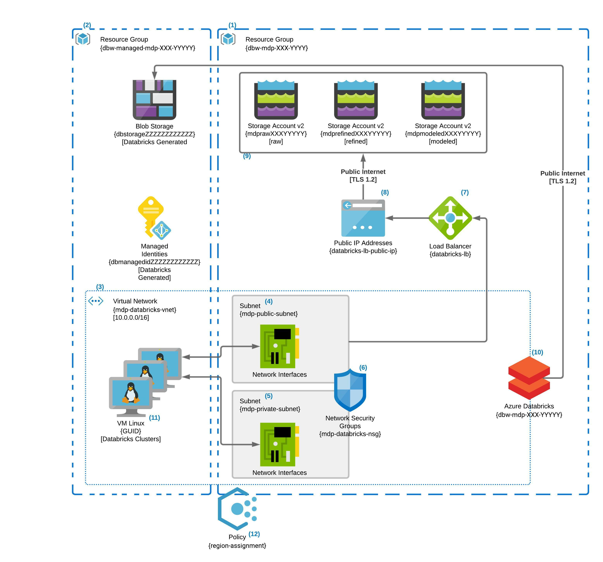

# terraform-moder-data-platform:

Modern Data Platform environment created using terraform

## Contents

- [Intro](#intro)
- [Requirements](#requirements)
- [1 - Resource Group](1-core-resource-group)
- [2 - Managed Resource Group](2-managed-resource-group)
- [Executing the Terraform](#executing-the-terraform)




## Intro

This release of the terraform-modern-data-platform provides a basic Azure Databricks instance and three Azure v2 Storage Accounts to serve as the Bronze, Silver, Gold storage model popular in the Data Lake House model.  The ADB instance is secured in this release by removing the public IP address requiring all traffic to go through the Loadbalancer and no direct external traffic allowed.  We have also implemented the first of many Azure Policies, restricting the geopolitical location of the Databricks instance to East US 2 and Central US.


## Requirements

- An Azure Subscription
- Terraform

## Details
Each number in the digram is described below

### 1 Core Resource Group
The "dbw-mdp-XXX-YYYYY" is the core resource group for the modern data platform; it contains all of the resources created by the terraform script.  Currently, the resource group contains the Azure Databricks service, the Vnet, subnets, and the load balancer and storage accounts.  Lastly, it contains an NSG that secures the subnets in which virtual NICs will be placed when Databricks Clusters are spun up. 

### 2 Managed Resource Group
The managed resources group is automatically created by the instantiation of the Azure Databricks Service.  This resource group is populated with a managed identity for the ADB services as well as a storage account for its internal functions.  This resource group is where the compute instances will be spun up for any Azure Databricks Clustered associated with the ADB Service.

## Executing the Terraform

### Initial Setup 
(once per environment) 

```{r, engine='sh', count_lines}
az account login
./ConfigureAzureForSecureTerraformAccess.sh
```

### Bootstrapping - from example directory
(per project/environment switch)

```
source ../TerraformAzureBootstrap.sh -f dev/dev.tfvars
terraform apply -var-file dev/dev.tfvars
```

### Example 1
source ../terraform-azure-bootstrap/TerraformAzureBootstrap.sh -f env/dev.tfvars
terraform apply --var-file env/dev.tfvars
